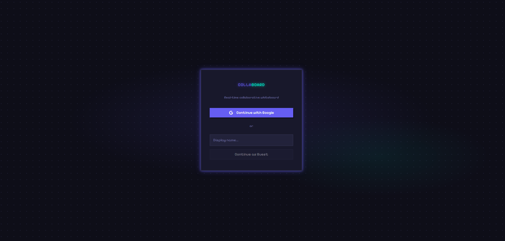
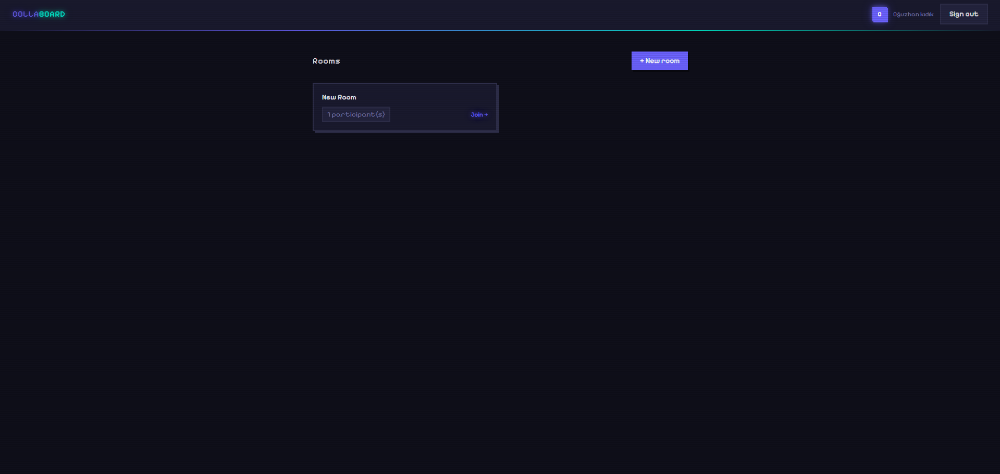
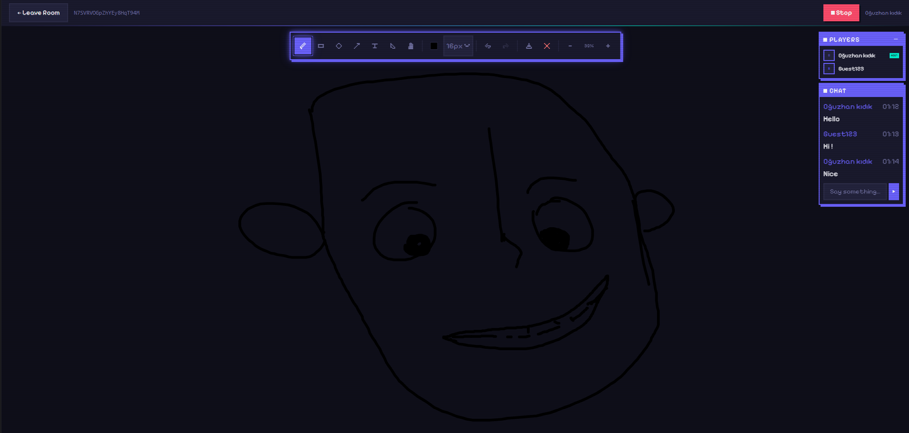
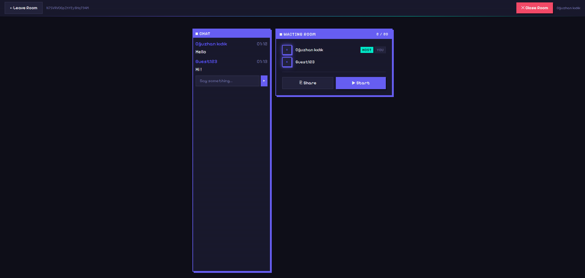

<div align="center">

# COLLABOARD

**Real-time collaborative whiteboard — draw together, instantly.**

[](https://vuejs.org/)
[](https://www.typescriptlang.org/)
[](https://socket.io/)
[](https://firebase.google.com/)
[](https://www.mongodb.com/)
[](https://pnpm.io/)

</div>

---

## Screenshots

| Login | Room List |
|-------|-----------|
|  |  |

| Whiteboard | Chat & Participants |
|------------|---------------------|
|  |  |

---

## Overview

Collaboard is a real-time collaborative whiteboard where multiple users can draw, add shapes, and write text simultaneously. Every action is broadcast instantly to all participants via WebSockets — no refresh, no lag.

Key highlights:

- **Rooms** — create public or private rooms; share a link to invite anyone
- **Lobby system** — host controls when the session starts; late joiners wait in the lobby, not mid-session
- **Live cursors** — see every participant's cursor move in real time, labeled with their name and color
- **Full drawing toolkit** — pen, shapes, text, select & move, undo/redo, zoom & pan
- **Persistent board** — board state is stored in MongoDB and synced to anyone who joins mid-session
- **Guest access** — no account needed to join an existing room

---

## Features

### Collaboration
- Real-time drawing sync via Socket.io (draw updates throttled to 60 fps)
- Live remote cursors for all participants (throttled to 30 ms)
- In-room chat with persistent message history
- Participant panel showing who is currently in the room

### Rooms
- Create public or private rooms
- Share a room link directly (private rooms are accessible only via link)
- Host-controlled lobby: host starts the session, guests wait
- Host transfer when the original host leaves
- Up to 20 participants per room

### Drawing Tools

| Tool | Description |
|------|-------------|
| Pen | Freehand drawing with smooth strokes |
| Rectangle | Click and drag to draw rectangles |
| Circle / Ellipse | Click and drag to draw ellipses |
| Arrow | Draw arrows between two points |
| Text | Click anywhere to place a text label |
| Select | Click to select, drag to move any element |

### Canvas Controls
- **Undo / Redo** — full history stack per session
- **Color picker** — any color for strokes and text
- **Stroke width** — 5 preset sizes (1 / 2 / 4 / 8 / 16 px)
- **Zoom & Pan** — scroll wheel zooms centered on cursor, hand tool drag-pans, +/− buttons for step zoom (25%–400%)
- **Export PNG** — exports the current canvas as a PNG file

### Auth
- Google Sign-In via Firebase Authentication
- Guest mode — join rooms without an account (cannot create rooms)
- Host-only actions: clear board, close room, start/stop session

---

## Tech Stack

### Frontend (`client/`)

| | |
|---|---|
| Framework | Vue 3 (Composition API, `<script setup>`) |
| Language | TypeScript 5 (strict mode) |
| State | Pinia |
| Routing | Vue Router 4 |
| Styling | Tailwind CSS v3 |
| Canvas | Native Canvas API |
| Real-time | Socket.io client 4.7 |
| Auth | Firebase SDK 10 |
| Bundler | Vite 5 |

### Backend (`server/`)

| | |
|---|---|
| Runtime | Node.js |
| Framework | Express 4 |
| Real-time | Socket.io 4.7 |
| Database | MongoDB + Mongoose 8 |
| Auth | Firebase Admin SDK 12 |
| IDs | nanoid 5 |
| Dev runner | tsx |

### Infrastructure

| | |
|---|---|
| Monorepo | pnpm workspaces |
| Frontend deploy | Vercel |
| Backend deploy | Railway |

---

## Architecture

```
Browser A                       Server                         Browser B
─────────                       ──────                         ─────────
draw:start  ──────────────────► broadcast to room ───────────► draw:remote
draw:update (16 ms throttle) ─► broadcast to room ───────────► draw:remote
draw:end    ──────────────────► persist to MongoDB ──────────► draw:remote

cursor:move (30 ms throttle) ─► broadcast to room ───────────► cursor:remote

room:join   ──────────────────► send room:state   ───────────► room:state  (full board)
                                send room:lobby   ───────────► room:lobby  (participants)
```

All `DrawElement` coordinates are stored in **world space**. The viewport transform (zoom + pan) is applied per-client at render time only, so board coordinates are always consistent across users with different zoom levels.

---

## Getting Started

### Prerequisites

- Node.js 18+
- pnpm 9+ — `npm install -g pnpm`
- A Firebase project with **Authentication → Google** sign-in enabled
- A MongoDB database (MongoDB Atlas free tier works)

### 1. Clone & install

```bash
git clone https://github.com/your-username/collaboard.git
cd collaboard
pnpm install
```

### 2. Configure environment variables

**`client/.env`**
```env
VITE_SOCKET_URL=http://localhost:3000
VITE_FIREBASE_API_KEY=
VITE_FIREBASE_AUTH_DOMAIN=
VITE_FIREBASE_PROJECT_ID=
VITE_FIREBASE_APP_ID=
```

**`server/.env`**
```env
PORT=3000
MONGODB_URI=mongodb://localhost:27017/collaboard
FIREBASE_PROJECT_ID=
FIREBASE_CLIENT_EMAIL=
FIREBASE_PRIVATE_KEY=
CLIENT_URL=http://localhost:5173
```

> Firebase Admin credentials: Firebase Console → Project Settings → Service accounts → Generate new private key.

### 3. Run locally

```bash
# Both client and server in parallel
pnpm dev

# Or separately
pnpm dev:client   # → http://localhost:5173
pnpm dev:server   # → http://localhost:3000
```

> **MongoDB optional for local dev** — if `MONGODB_URI` is not set, the server falls back to an in-memory room store (rooms are lost on restart).

### 4. Build for production

```bash
pnpm build
```

---

## Project Structure

```
collaboard/
├── client/                              # Vue frontend
│   └── src/
│       ├── components/
│       │   ├── canvas/
│       │   │   ├── WhiteboardCanvas.vue   # Canvas + all pointer/wheel events
│       │   │   ├── ToolBar.vue            # Tool selection, colors, zoom controls
│       │   │   ├── CursorOverlay.vue      # Remote cursor rendering
│       │   │   └── ParticipantPanel.vue   # Who's in the room
│       │   ├── room/
│       │   │   ├── RoomList.vue           # Room browser / home screen
│       │   │   ├── RoomLobby.vue          # Pre-session waiting room
│       │   │   └── CreateRoomModal.vue    # Room creation form
│       │   ├── chat/
│       │   │   └── ChatPanel.vue          # In-room chat
│       │   └── ui/                        # AppButton, AppModal
│       ├── composables/
│       │   ├── useCanvas.ts     # Canvas context, drawing, viewport transform
│       │   ├── useSocket.ts     # Socket.io connection lifecycle
│       │   └── useAuth.ts       # Firebase auth flow
│       ├── stores/
│       │   ├── canvasStore.ts   # Elements, tools, colors, zoom/pan state
│       │   ├── roomStore.ts     # Room state, participants, lobby
│       │   └── authStore.ts     # Authenticated user
│       ├── types/index.ts       # All shared TypeScript types (single source of truth)
│       └── constants/index.ts   # Throttle values, zoom limits, defaults
│
└── server/                              # Node.js backend
    └── src/
        ├── handlers/
        │   ├── drawingHandler.ts  # draw:start / draw:update / draw:end
        │   ├── cursorHandler.ts   # cursor:move broadcast
        │   └── roomHandler.ts     # join / leave / start / lobby events
        ├── models/
        │   ├── Room.ts            # Mongoose room schema
        │   └── Board.ts           # Mongoose board state schema
        ├── middleware/
        │   └── authMiddleware.ts  # Firebase token verification per connection
        └── index.ts               # Express + Socket.io bootstrap, REST /rooms
```
---

## License

MIT
